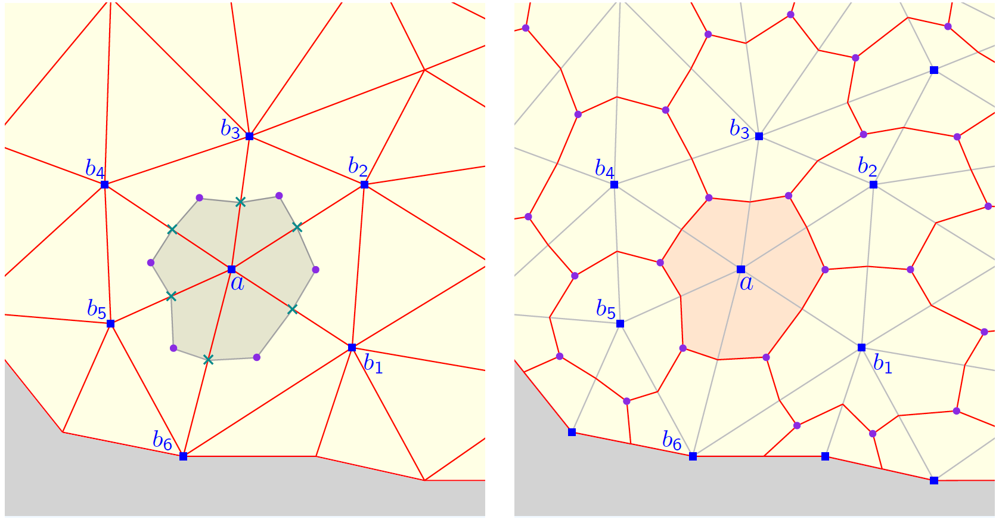

 

<h1>
 Vertex centred explicit solid dynamics toolkit for OpenFOAM

</h1>

 
  <a href="https://travis-ci.org/jibranhaider/explicitSolidDynamics_vc" target="_blank">
     &nbsp;
  </a>  
   &nbsp;
  <a href="https://github.com/jibranhaider/explicitSolidDynamics/blob/master/LICENSE">
     &nbsp;
  </a> 
      

   
   &nbsp;
   &nbsp;
   &nbsp;
    

 

## 1. Introduction    

This toolkit is based on a vertex centred Finite Volume Method to predict large deformation in solids. The governing equations comprise of a system of first order hyperbolic conservation laws for linear momentum and deformation gradient tensor similar to the ones found in Computational Fluid Dynamics.

 

 

#### Preprocessing

 

#### Results
 &nbsp; &nbsp; &nbsp; &nbsp;
 &nbsp; &nbsp; &nbsp; &nbsp;
 &nbsp; &nbsp; &nbsp; &nbsp;
 &nbsp; &nbsp; &nbsp; &nbsp;
 &nbsp; &nbsp; &nbsp; &nbsp;

 

 

## 2. How to use this toolkit?

The structure of this repository is similar to the [explicitSolidDynamics](https://github.com/jibranhaider/explicitSolidDynamics) toolkit which is based on the cell centred Finite Volume Method. Therefore, the reader is advised to consult the following webpages and adapt accordingly: 
* [Installation](https://github.com/jibranhaider/explicitSolidDynamics/wiki/Installation)
* [Tutorials](https://github.com/jibranhaider/explicitSolidDynamics/wiki/Tutorials)

 

 

## 3. FAQs

#### Does this toolkit support polyhedral elements?
* At the moment only tetrahedral elements are supported.

#### What additional features can we expect in future releases?
* Advanced constitutive models including plasticity, thermo/visco-elasticity.
* Quasi-static formulation.
* Parallel implementation of the vertex centred scheme.
* Multiple body contact problems.

 

 

## 4. Author
This toolkit is developed and maintained by [Jibran Haider](http://jibranhaider.weebly.com/). The following individuals are acknowledged for their support:
* [Dr. Chun Hean Lee](https://www.gla.ac.uk/schools/engineering/staff/chunheanlee/)
* [Prof. Antonio J. Gil](https://www.swansea.ac.uk/staff/engineering/a.j.gil/)
* [Prof. Javier Bonet](https://www.researchgate.net/profile/Javier_Bonet)

 

 

## 5. License
This toolkit is released under the GNU General Public License (version 3). More details can be found in the [LICENSE](LICENSE) file. 

 

 

## 6. Disclaimer
This offering is not approved or endorsed by OpenCFD Limited, producer and distributor of the OpenFOAM software via www.openfoam.com, and owner of the OPENFOAM® and OpenCFD® trade marks.

